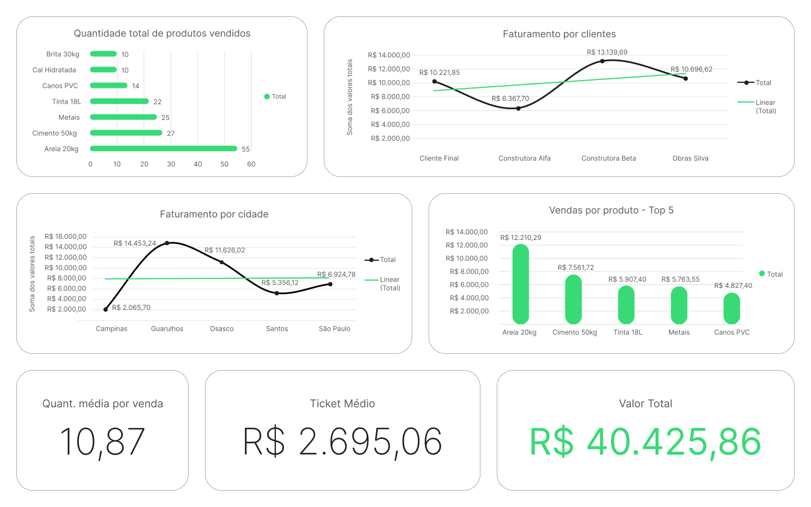
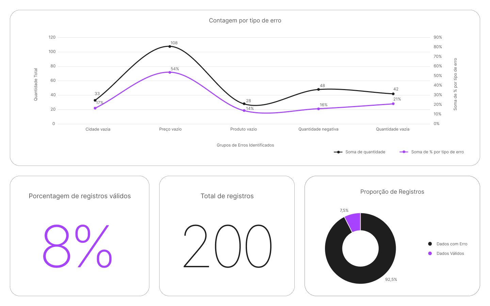
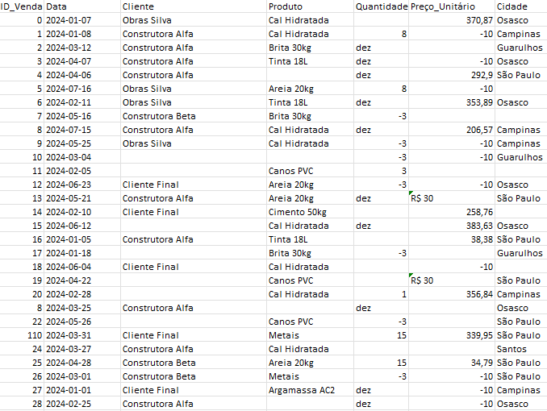
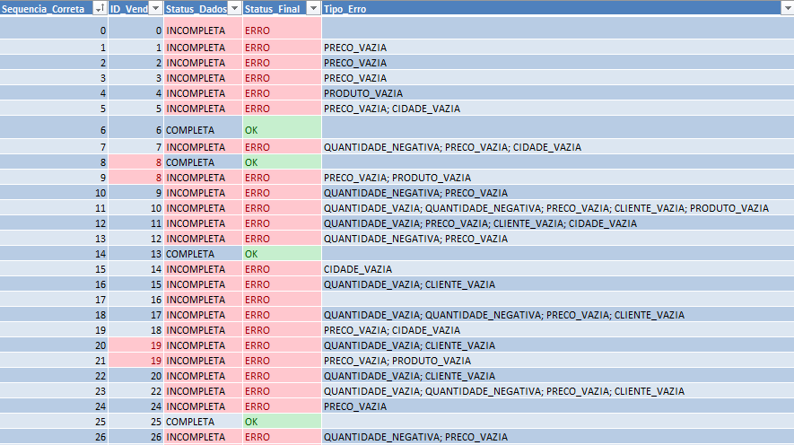
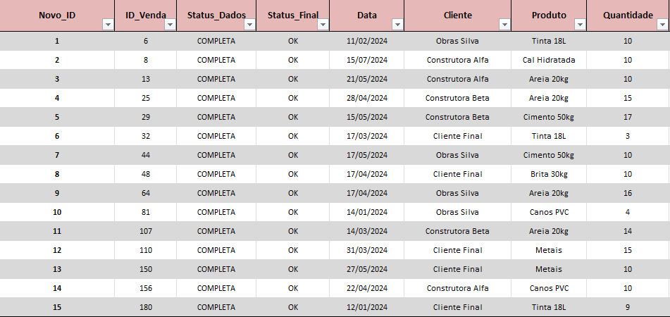

## 📝 Resumo do Projeto

Este projeto apresenta uma **Análise Exploratória de Dados (EDA)** aplicada a um conjunto de vendas de uma **Loja de Materiais de Construção** local.
O trabalho incluiu:

- Limpeza e avaliação da Qualidade dos Dados (DQ)

- Estruturação e padronização do dataset

- Criação de dashboards visuais através da plataforma Figma

- Análises sobre produtos, clientes, cidades e desempenho geral

Mesmo com um dataset reduzido após o tratamento, foi possível extrair insights consistentes, demonstrando como dados brutos podem ser convertidos em informações estratégicas para a tomada de decisão.

 

## 📉 Dashboards Desenvolvidos

-   **Dashboard Geral (EDA)**\
    

-   **Dashboard de Qualidade dos Dados (DQ)**\
    

 

## 🏪 Contexto

Os dados foram obtidos a partir de uma **Loja de Materiais de Construção
local** que enfrentava dificuldades para **visualizar, entender e
acompanhar suas vendas**.
O objetivo deste projeto foi conduzir uma **Análise Exploratória de
Dados (EDA)** completa, incluindo uma avaliação detalhada da qualidade dos dados, além da limpeza, organização e estruturação do conjunto, garantindo confiabilidade nas informações e possibilitando a geração de insights acionáveis.

 

## 🖼️ Etapas da Limpeza dos Dados (Antes → Processo → Depois)

Para evidenciar o impacto da limpeza e preparação da base, abaixo estão
as principais etapas acompanhadas de exemplos visuais da planilha:

### **1. 📥 Base Original (Antes da Limpeza)**

A planilha inicial apresentava múltiplas inconsistências: campos vazios,
datas fora de padrão, valores monetários sem formatação e registros
incompletos.

------------------------------------------------------------------------

### **2. 🔧 Processo de Tratamento e Estruturação**

Nesta etapa foram aplicadas regras de validação, criação de colunas
auxiliares, fórmulas de identificação de erros e padronização dos
campos. É aqui que ocorre a maior parte do trabalho técnico.

------------------------------------------------------------------------

### **3. 📊 Base Final Após a Limpeza**

Depois do tratamento, a base ficou padronizada, organizada e pronta para
análises e criação de dashboards. Só essa transformação já garante
confiabilidade muito maior às métricas geradas.

 

## ✔️ Análises Realizadas

### 1. KPIs Gerais

Foram calculadas métricas essenciais do desempenho do negócio: 
- Valor total das vendas
- Quantidade total vendida
- Ticket médio
- Quantidade média por venda

### 2. Produtos

Identificação dos produtos de maior impacto no faturamento e na
quantidade vendida, através de tabelas dinâmicas e gráficos de barra.

### 3. Clientes

Avaliação dos principais clientes, incluindo: - Faturamento por cliente
- Ticket médio individual
- Comparação entre tipos de cliente

### 4. Cidades

Análise geográfica do faturamento, destacando as localidades com melhor
desempenho por meio de gráficos de linha e coluna.

 

## 🧪 Análise da Qualidade dos Dados

Foi conduzido um processo estruturado de Avaliação da Qualidade dos Dados, que envolveu:

-   Criação de colunas auxiliares para identificação automática de
    erros.
-   Cálculo das métricas:
    -   Percentual de registros válidos
    -   Registros inválidos
    -   Percentual de registros inválidos
    -   Tipos de erros mais comuns
-   Preparação da base para uso em tabelas dinâmicas e gráficos de
    auditoria.

 

## ⚙️ Ferramentas utilizadas

-   **Excel** como principal ferramenta (limpeza, modelagem, cálculos e
    visualizações primárias).
-   **Figma** para criação e prototipação e dashboards em alta qualidade, garantindo a fidelidade das informações.

 

## 📝 Conclusão

Apesar de apenas **8% dos registros** estarem completamente válidos no
conjunto inicial, o processo de limpeza permitiu recuperar uma base
confiável para análise. Os erros mais frequentes estavam relacionados a
**campos vazios**, principalmente em *Quantidade do produto* e *Preço*, indicando
falhas importantes no processo de coleta e registro das informações.

Mesmo com o dataset reduzido, foi possível identificar **padrões
relevantes**: produtos que concentram boa parte do faturamento, clientes
com comportamento de compra consistente e cidades que se destacam tanto
em volume quanto em valor.

Esse resultado mostra que, mesmo partindo de dados limitados e de baixa
qualidade, uma **Análise Exploratória Estruturada** aliada a uma revisão
sólida da qualidade dos dados é capaz de transformar registros brutos em
**informações realmente úteis para a tomada de decisão**.

 
