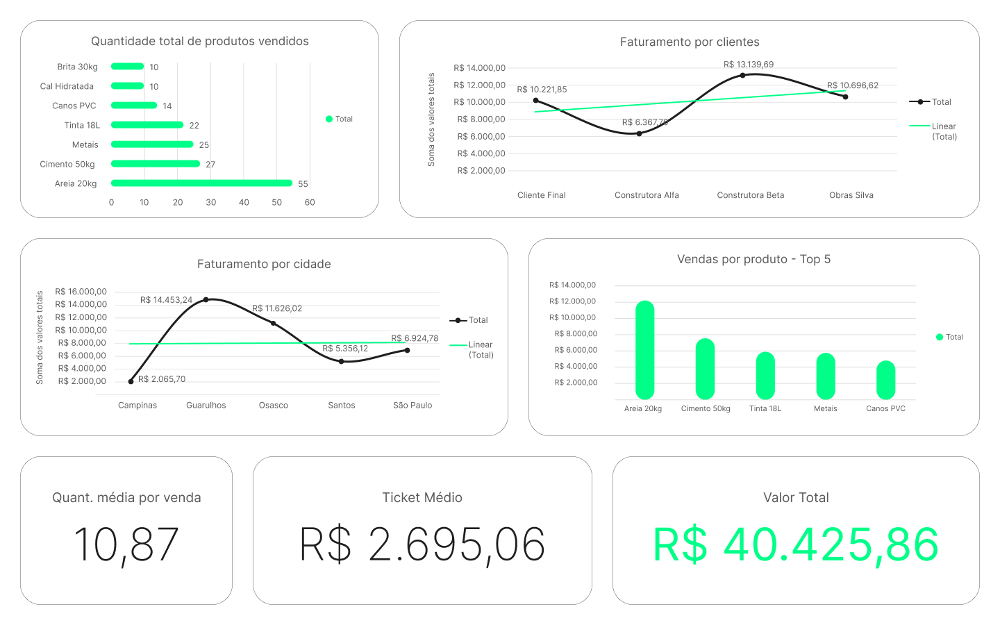

## 📉 Dashboards Desenvolvidos

-   **Dashboard Geral (EDA)**\
    

-   **Dashboard de Qualidade dos Dados**\
    *(Em desenvolvimento -- será adicionado em breve)*

 

## 🏪 Contexto

Os dados foram obtidos a partir de uma **Loja de Materiais de Construção
local** que enfrentava dificuldades para **visualizar, entender e
acompanhar suas vendas**.
O objetivo deste projeto foi conduzir uma **Análise Exploratória de
Dados (EDA)** completa, incluindo uma avaliação detalhada da qualidade dos dados, além da limpeza, organização e estruturação do conjunto, garantindo confiabilidade nas informações e possibilitando a geração de insights acionáveis.

 

## 🧹 Limpeza e Preparação dos Dados

O dataset inicial apresentava inconsistências, valores ausentes e
registros incorretos. As principais etapas realizas foram:

-   Identificação e remoção de registros incompletos.
-   Padronização de datas, formatos e valores monetários.
-   Criação de colunas derivadas (ex.: valor total por venda).
-   Validação final para garantir a integridade após o tratamento.

O resultado foi uma base pequena porém confiável, adequada para análises e
visualizações.

 

## ✅ Análises Realizadas

### 1. KPIs Gerais

Foram calculadas métricas essenciais do desempenho do negócio: - Valor
total das vendas:
- Quantidade total vendida
- Ticket médio
- Quantidade média por venda

### 2. Produtos

Identificação dos produtos de maior impacto no faturamento e na
quantidade vendida, com tabelas dinâmicas e gráficos de barra.

### 3. Clientes

Avaliação dos principais clientes, incluindo: - Faturamento por cliente
- Ticket médio individual
- Comparação entre tipos de cliente

### 4. Cidades

Análise geográfica do faturamento, destacando as localidades com melhor
desempenho por meio de gráficos de linha e coluna.

 

## 🧪 Análise da Qualidade dos Dados

Foi conduzido um processo estruturado de Avaliação da Qualidade dos Dados, que envolveu:

-   Criação de colunas auxiliares para identificação automática de
    erros.
-   Cálculo das métricas:
    -   Percentual de registros OK
    -   Registros com erro
    -   Percentual de erros
    -   Tipos de erro mais comuns
-   Preparação da base para uso em tabelas dinâmicas e gráficos de
    auditoria.

 

## ⚙️ Ferramentas utilizadas

-   **Excel** como ferramenta central (limpeza, modelagem, cálculos e
    visualizações).
-   **Figma** para criação e prototipação dos dashboards em alta qualidade, garantindo a fidelidade das informações.

 

## 📝 Conclusão

Mesmo com a redução de registros após a limpeza, foi possível extrair
**insights relevantes sobre vendas, clientes e produtos**, demosntrando
como a **Análise Exploratória Estruturada** consegue
transformar dados brutos em informações estratégicas para a tomada de
decisões.
