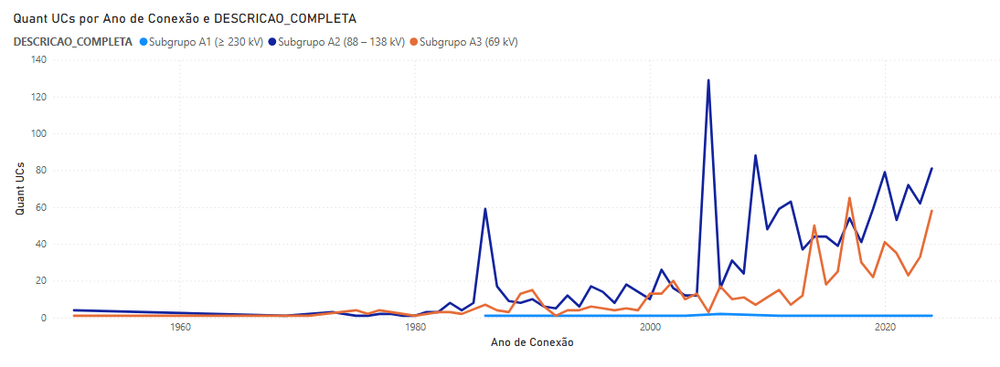

# Projeto 03.1 - Alta Tensão [PowerBI]

Este repositório documenta uma análise exploratória de dados (EDA) sobre o consumo elétrico no Brasil,
com foco em Unidades Consumidoras de alta tensão, a partir da base BDGD/ANEEL.

A análise foi desenvolvida utilizando o **Power BI** e corresponde ao **primeiro de três conjuntos de dados**
que compõem o **Projeto 03 — Consumo Elétrico**, o qual foi estruturado em etapas distintas conforme o
nível de tensão das Unidades Consumidoras.

Atualmente, o estudo desenvolvido sobre este dataset encontra-se estruturado em cinco blocos analíticos, seguidos por uma conclusão geral.

- [**Bloco A** — Identificação das Unidades Consumidoras](#bloco-a)
- [**Bloco B** — Distribuição geográfica e características gerais](#bloco-b)
- [**Bloco C** — Demanda/Carga e identificação de erro sistemático nos dados](#bloco-c)
- [**Bloco D** — Contratação e modalidade tarifária](#bloco-d)
- [**Bloco E** — Informações de Fornecimento](#bloco-e)
- [**Conclusão Geral** — Projeto 03.1 (Alta Tensão)](#conclusao-geral)

Cada bloco possui objetivos específicos e documentação própria, compondo de forma progressiva
a compreensão da estrutura, qualidade e comportamento da base de dados analisada.

---
<br>

<a id="bloco-a"></a>
## Bloco A — Identificação da Unidade Consumidora (UC)

### 🔍 Objetivo Analítico
O Bloco A tem como objetivo **compreender a distribuição espacial das Unidades Consumidoras (UCs)** presentes na base de dados, estabelecendo o contexto geográfico necessário para as análises posteriores de perfil, sistema elétrico e demanda.

<br>

### ⚙️ Tratamentos Realizados

- Utilização do **CEP** como principal identificador espacial, dada a ausência de um campo explícito de município em parte da base
- Derivação do campo **UF** a partir do código do município (**MUN**), garantindo consistência territorial
- Padronização dos campos geográficos para uso em mapas e segmentações

Esses tratamentos permitiram preservar o máximo de granularidade espacial possível sem introduzir inferências artificiais.

<br>

### 🗺️ Visualizações Desenvolvidas

- Mapa de **Total de UCs por CEP**
- Mapa de **Total de UCs por UF**

Essas visualizações possibilitam identificar rapidamente padrões de concentração regional e servem como base para cruzamentos posteriores com variáveis técnicas e de consumo.

<br>

### 🧠 Principais Achados

- Observa-se uma **forte concentração de UCs nos estados de São Paulo (SP) e Minas Gerais (MG)**
- Em conjunto, esses dois estados concentram aproximadamente **80% das Unidades Consumidoras analisadas**

Esse resultado é coerente com o perfil histórico de industrialização e densidade econômica dessas regiões, reforçando a validade espacial da base de dados.

---
<br>

<a id="bloco-b"></a>
## Bloco B — Tipo de Sistema (TIP_SIST) e Regime de Contratação (LIV)

### 🔍 Objetivo Analítico
O Bloco B busca caracterizar as Unidades Consumidoras quanto ao **tipo de sistema elétrico ao qual estão conectadas** e ao **regime de contratação**, fornecendo o pano de fundo institucional e operacional para a análise de demanda.

<br>

### 🛠️ Tratamentos e Modelagem

- Análise do campo **TIP_SIST**, que classifica o tipo de sistema elétrico
> **Nota metodológica**: o campo **TIP_SIST não consta no dicionário oficial de dados** disponibilizado para o conjunto analisado. Ainda assim, optou-se por incluí-lo no estudo devido à sua **alta relevância analítica**, uma vez que permite distinguir estruturalmente o tipo de sistema elétrico ao qual as Unidades Consumidoras estão conectadas. Sua utilização mostrou-se consistente ao longo das análises exploratórias e agregou valor interpretativo ao EDA.

- Criação da coluna derivada **LIV_Status**, traduzindo o campo técnico **LIV** em categorias semanticamente legíveis:
  - Consumidor Livre
  - Consumidor Cativo

Esse tratamento permitiu maior clareza interpretativa nas visualizações e facilitou a interação entre filtros e gráficos.

<br>

### 📉 Visualizações Desenvolvidas

- Gráfico de rosca do **TIP_SIST**
- Gráfico de rosca do **LIV_Status**, totalmente interativo com os demais elementos do relatório

<br>

### 🧠 Principais Achados

- Aproximadamente **93,78% das UCs estão conectadas à Rede Interligada**, confirmando a predominância do Sistema Interligado Nacional (SIN)
- A segmentação por **Consumidor Livre / Cativo** permite análises comparativas relevantes nos blocos seguintes, especialmente no estudo de demanda e carga

---

**[NOTA]:** Esses dois blocos estabelecem a **base estrutural e institucional** do projeto, garantindo que as análises de demanda realizadas no Bloco C sejam interpretadas à luz da distribuição geográfica, do tipo de sistema elétrico e do regime de contratação das Unidades Consumidoras.

---
<br>

<a id="bloco-c"></a>
## Bloco C — Demanda / Carga: Análise Histórica, Ruptura Estrutural e Avaliação de Unidade

## 🔍 1. Contexto e Problema Inicial

Durante a análise da demanda das Unidades Consumidoras (UCs), foram identificados **valores implausíveis e uma ruptura estrutural clara na série histórica**, concentrada no início dos anos 2000.

### Evidência 1 — Ordens de Grandeza Incompatíveis
- **Período 2003–2024 (análise observada)**: a Demanda Média por UC atinge valores da ordem de **bilhões de kW**, incompatíveis com a capacidade instalada do sistema elétrico brasileiro e com limites físicos conhecidos.

### Evidência 2 — Salto Temporal Inexplicável

```
2003: ~300 milhões
2004: ~7 bilhões
Variação: +2.233% em 1 ano
```

Esse crescimento não encontra respaldo em variáveis macroeconômicas, expansão de infraestrutura ou mudanças conhecidas no perfil de carga do período.

### Evidência 3 — Quebra de Padrão Histórico
- **1960–2002 (Bloco C1)**: valores estáveis e fisicamente plausíveis
- **2003 em diante (Bloco C2)**: mudança abrupta de escala, sugerindo alteração cadastral, metodológica ou semântica

<br>

##  2. Estrutura Analítica do Bloco C

Para tratar adequadamente essa ruptura, o Bloco C foi segmentado da seguinte forma:

- **C1 — Demanda / Carga (1960–2002)**: análise do período histórico pré-ruptura
- **C2 — Demanda / Carga (2003–2024)**: análise observada do período pós-ruptura
- **C2.1 — Hipótese de Unidade e Rotulagem (W × kW)**
- **C2.2 — Demanda Ajustada (Avaliação do Impacto da Hipótese)**

Essa estrutura permite separar claramente:
- o comportamento observado do dado
- a hipótese explicativa
- a avaliação quantitativa do impacto da interpretação correta da unidade

<br>

## 🔬 3. KPIs Utilizados e Validação Interna

KPIs aplicados em todos os períodos:
- Demanda Média por UC
- Demanda Mediana por UC
- Capacidade Instalada Média por UC (CAR_INST)
- Razão Demanda (DEM_P e DEM_F) / Carga Instalada (CAR_INST)

### Teste de Consistência Estrutural

```DAX
Razao_Demanda_CAR_INST = DIVIDE([Demanda Média por UC], [CAR_INST Média por UC])
```

**Resultados:**
- **C1 (1960–2002)**: razão ≈ **0,01**, significativamente inferior à observada em C2, com valor extremamente baixo para uma razão dessa natureza, sugerindo erro estrutural na forma de registro dos dados
- **C2 (2003–2024)**: razão ≈ **0,85**, indicando elevada utilização e coerência interna

A preservação dessa razão ao longo das análises indica que a inconsistência observada não está na relação entre as variáveis, mas na escala absoluta dos valores registrados.

<br>

## 🧠 4. C2.1 — Hipótese de Unidade e Rotulagem (W → kW)

A hipótese central deste trabalho é que os valores de demanda registrados a partir de 2003 **permaneceram numericamente em watts (W)**, porém passaram a ser **rotulados como quilowatts (kW)** no dicionário de dados, sem que a conversão numérica correspondente (divisão por 1.000) fosse aplicada.

Sob essa hipótese:
- os números registrados não estariam incorretos
- o problema residiria na **semântica da unidade**, e não na integridade do dado

Essa interpretação explica simultaneamente:
- os picos extremos observados
- a coerência interna entre demanda e capacidade instalada
- a ruptura abrupta a partir de 2003

<br>

## 5. C2.2 — Avaliação Quantitativa sob a Hipótese W → kW

Aplicando-se um fator de conversão uniforme (W → kW), exclusivamente para fins analíticos, obtêm-se os seguintes resultados ajustados para o período 2003–2024:

- **Demanda Média por UC (ajustada)**: **5,13 MW**
- **Demanda Mediana por UC (ajustada)**: **64,30 kW**
- **CAR_INST Média por UC (ajustada)**: **5,99 MW**
- **Razão Demanda / CAR_INST**: **0,85**

Esses valores apresentam **ordens de grandeza fisicamente plausíveis** para consumidores conectados em alta tensão e preservam integralmente as relações estruturais observadas nos dados originais.

A elevada diferença entre média e mediana evidencia uma distribuição fortemente assimétrica, na qual um subconjunto reduzido de grandes consumidores exerce influência significativa sobre a média do período.

Essa assimetria observada sugere a presença de valores extremos distribuídos ao longo do período analisado, cuja natureza, requer investigação específica posterior.

<br>

## 6. 📉 Visualizações e Exploração

- Séries temporais de demanda média e mediana por UC
- Comparação entre valores observados e ajustados (C2 × C2.2)
- Segmentações por `ANO_CONEXAO`, `LIV_Status` e `TIP_SIST`
- Identificação e contextualização de outliers históricos

<br>

## 7. Limitações

- A conversão W → kW é tratada como **hipótese analítica**, não como correção oficial da base
- Mudanças metodológicas e cadastrais entre períodos limitam comparações diretas
- O estudo não substitui validação documental formal junto à ANEEL

<br>

## 8. Conclusão Técnica do Bloco

A análise do Bloco C evidencia uma **ruptura estrutural clara** na série de demanda a partir de 2003. Os resultados indicam que os valores registrados mantêm coerência interna, mas apresentam ordens de grandeza incompatíveis quando interpretados diretamente como kW.

A hipótese de erro de rotulagem de unidade (W → kW) mostrou-se capaz de restaurar a plausibilidade física dos indicadores sem alterar suas relações estruturais, permitindo uma leitura mais realista do comportamento da carga no período recente.

Essa abordagem reforça a importância da validação semântica de unidades em análises de dados históricos de grande escala, especialmente em contextos de transição metodológica.

---
<br>

<a id="bloco-d"></a>
## Bloco D — Contratação / Modalidade Tarifária

Este bloco tem como objetivo analisar o perfil de contratação das Unidades Consumidoras,
explorando a distribuição e a evolução das modalidades tarifárias ao longo do tempo.

- Neste contexto, a modalidade tarifária é tratada como a **forma contratual sob a qual a
Unidade Consumidora se conecta ao sistema elétrico**, refletindo regras de acesso,
faturamento e enquadramento regulatório, e não seu nível de consumo ou desempenho energético.

- A análise é de caráter exploratório, buscando identificar padrões, mudanças estruturais
e diferenças na distribuição das modalidades ao longo do tempo, considerando recortes
por tipo de sistema e geográficos apenas como lentes de observação, sem inferência causal
ou avaliação econômica nesta etapa.

Os resultados deste bloco servem como base para análises comparativas posteriores e para a
compreensão do contexto regulatório e operacional da base de dados.

<br>

### 📃 Grupos Tarifários — Referência (Manual ANEEL)

A tabela abaixo foi construída a partir da documentação oficial `Manual_de_Instruções_da_BDGD.pdf`, sendo utilizada
como referência conceitual ao longo do projeto.

| Código | Descrição |
|------|----------|
| 0 | Não informado |
| A1 | Subgrupo A1 – tensão de fornecimento igual ou superior a 230 kV |
| A2 | Subgrupo A2 – tensão de fornecimento de 88 kV a 138 kV |
| A3 | Subgrupo A3 – tensão de fornecimento de 69 kV |
| A3A | Subgrupo A3a – tensão de fornecimento de 30 kV a 44 kV |
| A4 | Subgrupo A4 – tensão de fornecimento de 2,3 kV a 25 kV |
| AS | Subgrupo AS |
| B1 | Subgrupo B1 – residencial |
| B1BR | Subgrupo B1 – residencial baixa renda |
| B2RU | Subgrupo B2 – rural |
| B2CO | Subgrupo B2 – cooperativa de eletrificação rural |
| B2SP | Subgrupo B2 – serviço público de irrigação |
| B3 | Subgrupo B3 – demais classes |
| B4A | Subgrupo B4 – iluminação pública – propriedade do poder público |
| B4B | Subgrupo B4 – iluminação pública – propriedade da distribuidora |

> Embora a tabela apresente todos os grupos tarifários previstos no manual da ANEEL, este projeto analisa, neste momento, apenas os subgrupos de alta tensão efetivamente presentes no dataset.

<br>

### Evolução das Unidades Consumidoras por Subgrupo Tarifário (Alta Tensão)


---

### 🔎 Descrição do Visual Analisado

- **Eixo X**: Ano de conexão da UC  
- **Eixo Y**: Quantidade de Unidades Consumidoras  
- **Legenda**:  
  - Subgrupo A1 (≥ 230 kV)  
  - Subgrupo A2 (88–138 kV)  
  - Subgrupo A3 (69 kV)

<br>

### 1️⃣ Subgrupo A1 (≥ 230 kV)

O subgrupo A1 permanece **residual ao longo de toda a série histórica**, com valores próximos
de zero e sem variações relevantes.

Este comportamento indica que, dentro da base analisada, as conexões em tensões iguais ou
superiores a 230 kV representam uma parcela muito pequena do total de UCs.

<br>

### 2️⃣ Subgrupo A2 (88–138 kV): volatilidade e picos

O subgrupo A2 passa a apresentar crescimento após os anos 1980, caracterizado por:

- picos abruptos em anos específicos,
- alta variabilidade ao longo do tempo,
- ausência de crescimento estritamente contínuo.

Esse padrão sugere que o comportamento do A2 pode estar associado a **eventos pontuais** ou
processos concentrados em determinados períodos, em vez de uma expansão gradual.

<br>

### 3️⃣ Subgrupo A3 (69 kV): crescimento mais gradual

Em contraste com o A2, o subgrupo A3 apresenta:

- crescimento mais progressivo,
- menor volatilidade relativa,
- aumento consistente principalmente nos anos mais recentes.

Adicionalmente, observa-se que, em determinados períodos, há um comportamento alternado entre
A2 e A3, em que a redução de um coincide com o aumento do outro.

Esse padrão sugere hipóteses exploratórias como:

- possíveis reclassificações tarifárias ao longo do tempo,
- mudanças nos critérios regulatórios de enquadramento,
- estratégias contratuais adotadas por consumidores e distribuidoras.

<br>

### 4️⃣ Período anterior aos anos 1980

O gráfico indica que, até o final da década de 1970, o volume de registros de UCs conectadas
em alta tensão é reduzido e apresenta pouca variação entre os subgrupos.

É importante ressaltar que este comportamento não implica necessariamente a inexistência de UCs nesse período, mas pode refletir limitações históricas relacionadas a:

- processos de regulamentação do setor elétrico;
- ausência de padronização nacional;
- registro incompleto das informações nas bases de dados;
- descontinuidade institucional de empresas responsáveis pela operação, registro ou regulação dessas Unidades Consumidoras, o que pode ter resultado na perda ou não incorporação de dados históricos aos sistemas atuais.

Assim, o baixo volume observado pode estar mais associado à formalização, consolidação institucional e documentação progressiva das Unidades Consumidoras do que à dinâmica real de conexão ao sistema elétrico.

<br>

### 5️⃣ Intensificação a partir dos anos 1980

A partir dos anos 1980, observa-se um aumento claro no volume de registros, indicando uma
mudança no padrão da série temporal.

Este comportamento pode estar associado, de forma exploratória, a processos de reorganização
institucional e regulatória do setor elétrico brasileiro, incluindo:

- avanços institucionais no setor elétrico;
- maior organização regulatória ao longo das décadas seguintes;
- fortalecimento progressivo dos mecanismos de registro e acompanhamento das Unidades Consumidoras;
- criação e consolidação de órgãos reguladores, como a Agência Nacional de Energia Elétrica (ANEEL), instituída em 1996, que contribuiu para a padronização e centralização das informações do setor.

Esta hipótese não é afirmada como causal, mas surge como um **contexto histórico plausível**
para a mudança observada no comportamento da série temporal.

<br>

### 6️⃣ Anos 2000 em diante: mudança estrutural visível

A partir dos anos 2000, o gráfico apresenta uma **mudança clara de patamar**, caracterizada por:

- aumento do volume médio de UCs conectadas,
- maior variabilidade na série,
- novo regime visual em relação ao período anterior.

Essa mudança estrutural é visível exclusivamente a partir do comportamento da série temporal e mostra-se coerente com a ruptura técnica identificada no [**Bloco C**](#bloco-c), reforçando a existência de um novo regime nos dados a partir dos anos 2000, agora observado sob a ótica contratual.

Como contexto interpretativo, esse período é compatível com uma fase de maior dinamismo econômico e tecnológico no Brasil, embora esta análise não estabeleça relações causais.

<br>

### 🧠 Considerações finais desta etapa

Esta interpretação inicial cumpre o papel de:

- descrever padrões observáveis no gráfico,
- levantar hipóteses plausíveis e testáveis,
- reconhecer limitações históricas e regulatórias da base de dados.

As conclusões aqui apresentadas servem como **base para análises comparativas posteriores**
e para eventual incorporação de contexto histórico-regulatório em etapas futuras do projeto.

---
<br>

<a id="bloco-e"></a>
## Bloco E — Informações de Fornecimento  

O Bloco E tem como objetivo analisar as **características técnicas do fornecimento de energia elétrica**
das Unidades Consumidoras (UCs) de alta tensão presentes na base BDGD, buscando compreender
**como a energia é entregue**, sob quais padrões técnicos, e como esses padrões se distribuem
entre diferentes sistemas, perfis contratuais e recortes geográficos.

Este bloco possui caráter **descritivo e exploratório**, não realizando inferências causais,
avaliações de eficiência ou análises de consumo energético, as quais são tratadas em outros
blocos do projeto.

<br>

### 🔍 Considerações Metodológicas Iniciais

Os campos analisados neste bloco incluem, principalmente:

- **`TEN_FORN`** — código de referência da tensão de fornecimento  
- **`GRU_TEN`** — grupo de tensão (Alta Tensão)  
- **`TIP_SIST`** — tipo de sistema (Rede Interligada ou Rede Isolada)  
- **`GRU_TAR`** — grupo tarifário (A1, A2, A3)  
- **Localização geográfica** (UF)

O campo **`TEN_FORN`** representa **códigos de domínio definidos pela BDGD**, não correspondendo
diretamente a valores numéricos de tensão em kV. A interpretação técnica desses códigos foi
realizada por meio de consulta ao **Manual de Instruções da BDGD**, sendo a tradução para kV
utilizada apenas como **camada interpretativa**, sem alteração da estrutura original dos dados.

Além disso, este bloco **não realiza segmentação temporal**, diferentemente do Bloco C.  
Como as variáveis analisadas representam **características técnicas e cadastrais**, e não valores
medidos, as análises são conduzidas considerando o **conjunto completo da série histórica**,
com cautela quanto à interpretação de registros residuais ou históricos.

<br>

### 📄 Referência Técnica — Códigos de Tensão de Fornecimento (`TEN_FORN`)

A interpretação dos códigos de tensão de fornecimento utilizados neste bloco foi realizada com
base na documentação oficial da BDGD, conforme apresentado no **Manual de Instruções da BDGD**.

A tabela abaixo é utilizada como **referência conceitual**, permitindo associar os códigos
presentes no dataset aos respectivos níveis de tensão, **sem alterar os valores originais dos
dados**, que permanecem representados por seus códigos de domínio.

| Código (`TEN_FORN`) | Descrição | Nível de Tensão |
|--------------------|-----------|-----------------|
| 82 | Alta Tensão | 69 kV |
| 83 | Alta Tensão | 88 kV |
| 84 | Alta Tensão | 138 kV |
| 94 | Alta Tensão | 230 kV |
| 95 | Alta Tensão | 345 kV |
| 96 | Alta Tensão | ≥ 440 kV |

> **Nota metodológica:**  
> Os códigos de tensão foram mantidos nos gráficos e cruzamentos analíticos (`TEN_FORN`), sendo
> a conversão para valores em kV utilizada exclusivamente como apoio interpretativo, conforme
> documentação oficial, sem qualquer transformação ou recodificação da base original.

<br>

## E1 — Visão Geral do Fornecimento

A análise inicial da distribuição das Unidades Consumidoras por código de tensão de fornecimento
(`TEN_FORN`) indica **forte concentração em poucos padrões técnicos**.

Observa-se que a maior parte das UCs de alta tensão está associada a um **conjunto restrito de
códigos**, com clara predominância de alguns níveis específicos, enquanto os demais aparecem de
forma residual. Esse comportamento sugere que o fornecimento de energia elétrica em alta tensão,
na base analisada, **não apresenta grande diversidade técnica**, operando majoritariamente em
padrões bem definidos.

Adicionalmente, verificou-se **coerência técnica** entre os campos `TEN_FORN` e `GRU_TEN`, sendo
o primeiro responsável pela granularidade analítica do fornecimento e o segundo pela
identificação do macrogrupo de tensão (Alta Tensão).

<br>

## E2 — Fornecimento × Tipo de Sistema

### Distribuição geral por tipo de sistema

A análise da distribuição das UCs por tipo de sistema (`TIP_SIST`) evidencia **forte predominância
da Rede Interligada**, que concentra a maior parte das Unidades Consumidoras de alta tensão da base
analisada. As Redes Isoladas representam uma **parcela significativamente menor** do total de
registros.

Este resultado é utilizado como **contexto analítico**, servindo de base para a interpretação
dos cruzamentos entre fornecimento técnico e tipo de sistema.

<br>

### Códigos de tensão por tipo de sistema

Ao cruzar os códigos de tensão de fornecimento (`TEN_FORN`) com o tipo de sistema (`TIP_SIST`),
observa-se uma **diferença clara na diversidade técnica** entre os sistemas:

- A **Rede Interligada** apresenta **maior variedade de códigos de tensão**, com seis códigos
  distintos identificados, sendo os mais representativos:
  - `TEN_FORN = 94` (predominante),
  - seguido por `TEN_FORN = 82`,
  - e `TEN_FORN = 84`.

- As **Redes Isoladas** operam com um **conjunto mais restrito**, no qual aparecem apenas três
  códigos:
  - `TEN_FORN = 94` (claramente dominante),
  - seguido por `TEN_FORN = 84`,
  - e `TEN_FORN = 82`, com menor participação.

O código **`TEN_FORN = 96`**, associado a níveis mais elevados de tensão, aparece de forma
**extremamente residual** na Rede Interligada (10 UCs) e **não está presente** nas Redes Isoladas.

Esse padrão sugere que sistemas isolados operam com **maior padronização técnica**, enquanto a
Rede Interligada concentra a maior diversidade de níveis de tensão de fornecimento.

<br>

### E2 — Fornecimento × Localização Geográfica

A análise espacial dos códigos de tensão de fornecimento, considerando o recorte por Unidade
Federativa (UF), revela padrões relevantes:

- **São Paulo (SP)** e **Minas Gerais (MG)** concentram a maior parte das Unidades Consumidoras.
- Em **São Paulo**, os códigos mais frequentes são:
  - `TEN_FORN = 94`,
  - seguido por `TEN_FORN = 84`.
- Em **Minas Gerais**, observa-se predominância de:
  - `TEN_FORN = 95`,
  - seguido por `TEN_FORN = 94`.

De forma relevante, o código **`TEN_FORN = 96` não aparece** nos estados com maior volume de UCs
(SP e MG), estando presente apenas de maneira pontual em:

- **Rio Grande do Sul** (1 UC),
- **Pernambuco** (4 UCs),
- **Bahia** (5 UCs).

Nos demais estados, observa-se essencialmente a presença dos códigos **94 e 82**, indicando um
padrão técnico ainda mais concentrado.

Embora esses padrões sugiram possíveis diferenças regionais na adoção de níveis de tensão,
**a base de dados analisada não permite inferências causais** sobre os fatores estruturais ou
históricos que expliquem tal distribuição.

<br>

### E3 — Fornecimento × Perfil Tarifário da Unidade Consumidora

O cruzamento entre os códigos de tensão de fornecimento (`TEN_FORN`) e os grupos tarifários
(`GRU_TAR`) indica **elevada coerência técnica** entre o nível de tensão fornecido e o
enquadramento tarifário predominante das UCs.

- **Grupo A1**:
  - Predominância de `TEN_FORN = 96` (10 UCs),
  - Ocorrência residual de `TEN_FORN = 82` (1 UC).

- **Grupo A2**:
  - Predominância de `TEN_FORN = 95`, `94` e `84`,
  - Presença de `TEN_FORN = 82` em 9 UCs.

- **Grupo A3**:
  - Predominância clara de `TEN_FORN = 82`,
  - Presenças residuais de `TEN_FORN = 83` (2 UCs) e `TEN_FORN = 94` (2 UCs).

As exceções observadas representam **volumes muito reduzidos** e não descaracterizam o padrão
geral de coerência entre fornecimento e enquadramento tarifário. Esses registros podem estar
associados a reclassificações tarifárias, contratos específicos ou registros históricos mantidos
na base, não sendo possível classificá-los como inconsistências apenas com base nos dados
disponíveis.

<br>

### E4 — Qualidade dos Dados e Limitações

A análise do Bloco E identificou alguns pontos de atenção:

- Existência de códigos de tensão com **baixa representatividade**, como `TEN_FORN = 96` e
  `TEN_FORN = 83`, que não sustentam análises isoladas;
- Ocorrências pontuais de códigos fora do padrão dominante de determinados grupos tarifários;
- Presença de registros históricos e ausência de informações que permitam validação normativa
  ou reconstrução do contexto regulatório individual de cada UC.

Essas limitações **não invalidam** as análises realizadas, mas delimitam seu escopo interpretativo,
reforçando o caráter exploratório do bloco.

---
<br>

<a id="conclusao-geral"></a>
## Conclusão Geral do Projeto 03.1 - Alta Tensão

### Visão Geral do Projeto
O Projeto 03.1 apresentou uma **análise exploratória estruturada** das Unidades Consumidoras de alta tensão a partir da base BDGD/ANEEL. O foco esteve na organização, validação e interpretação crítica dos dados, respeitando seus limites históricos, cadastrais e metodológicos.

A abordagem adotada priorizou a **construção progressiva do entendimento da base**, evitando inferências não suportadas e reforçando a leitura técnica do conjunto de dados.

<br>

### 🗺️ Blocos A e B - Contexto Espacial e Institucional 
Os Blocos A e B cumpriram o papel de estabelecer o **alicerce estrutural do Projeto 03.1**, fornecendo o contexto espacial, sistêmico e institucional necessário para a interpretação adequada das análises posteriores.

- No Bloco A, a distribuição geográfica das Unidades Consumidoras evidenciou uma **forte concentração regional**, com São Paulo e Minas Gerais respondendo por aproximadamente 80% das UCs analisadas. Esse padrão mostrou-se coerente com a estrutura econômica e industrial dessas regiões, reforçando a **consistência espacial da base de dados** após os tratamentos realizados.

- O Bloco B complementou essa leitura ao caracterizar as UCs quanto ao **tipo de sistema elétrico** e ao **regime de contratação**. Observou-se ampla predominância da **Rede Interligada**, confirmando o papel central do SIN - Sistema Interligado Nacional, enquanto a distinção entre **Consumidores Livres e Cativos** foi consolidada como eixo analítico relevante para comparações nos blocos seguintes.

Em conjunto, esses blocos garantem que as análises de demanda, contratação e fornecimento sejam interpretadas à luz de um **contexto geográfico e institucional bem definido**, evitando leituras isoladas ou descontextualizadas dos indicadores técnicos.

<br>

### ⚡ Bloco C - Demanda / Carga

O Bloco C identificou uma **ruptura estrutural clara na série histórica de demanda** das Unidades Consumidoras a partir de 2003, caracterizada por mudanças abruptas de escala e ordens de grandeza incompatíveis quando os valores são interpretados diretamente como quilowatts (kW).

A análise revelou a existência de **dois regimes historicamente distintos**. No período pré-2003, a razão Demanda / Capacidade Instalada apresentou valor extremamente baixo (≈ 0,01), indicando fragilidade estrutural ou limitações metodológicas no registro dos dados históricos. Já no período pós-2003, apesar da ruptura evidente na escala absoluta dos valores, observou-se **elevada coerência interna** entre demanda e capacidade instalada, com razão próxima de 0,85, compatível com padrões técnicos esperados para consumidores de alta tensão.

Nesse contexto, a hipótese de **erro de rotulagem de unidade (W → kW)** mostrou-se capaz de restaurar a plausibilidade física dos indicadores do período recente **sem alterar suas relações estruturais**, indicando que a inconsistência observada está associada à semântica da unidade e não à integridade relacional do dado.

Os resultados reforçam a importância de uma **EDA crítica e semântica**, especialmente em bases históricas sujeitas a mudanças metodológicas e cadastrais, e delimitam claramente os limites de comparabilidade entre os períodos analisados.

<br>

### 📃 Conclusão do Bloco D — Contratação / Modalidade Tarifária

A análise do Bloco D permitiu caracterizar o perfil de contratação das Unidades Consumidoras de alta tensão ao longo do tempo, evidenciando padrões distintos entre os subgrupos tarifários e mudanças estruturais na série histórica.

Os resultados indicam que os subgrupos A1, A2 e A3 apresentam comportamentos heterogêneos, com o A1 mantendo participação residual, o A2 exibindo maior volatilidade associada a eventos pontuais e o A3 demonstrando crescimento mais gradual e consistente. A alternância observada entre A2 e A3 em determinados períodos sugere possíveis processos de reclassificação tarifária ou ajustes regulatórios ao longo do tempo.

Adicionalmente, o baixo volume de registros anterior aos anos 1980 e a intensificação progressiva a partir desse período apontam para limitações históricas de registro e para o fortalecimento institucional e regulatório do setor elétrico brasileiro, mais do que para variações reais no número de conexões.

A partir dos anos 2000, observa-se uma mudança clara de patamar na série, caracterizada por maior volume e variabilidade de Unidades Consumidoras, indicando um novo regime estrutural nos dados de contratação.

Este bloco cumpre, portanto, o papel de contextualizar a dimensão contratual e regulatória da base de dados, fornecendo suporte interpretativo para análises posteriores e reforçando a necessidade de considerar transições institucionais e cadastrais na leitura de séries históricas do setor elétrico.

<br>

### 🔌 Bloco E - Fornecimento e Padrões Técnicos
O Bloco E documentou como a energia elétrica é **tecnicamente fornecida** às Unidades Consumidoras de alta tensão.

Os principais achados incluem:
- forte **padronização nos códigos de tensão**;
- elevada **coerência técnica** entre fornecimento e enquadramento tarifário;
- maior diversidade técnica na **Rede Interligada**, em contraste com a padronização das Redes Isoladas.

As limitações identificadas foram contextualizadas como inerentes à natureza histórica da base, sem comprometer a validade dos padrões observados.

A análise do Bloco E permitiu caracterizar, de forma descritiva, **como o fornecimento de energia elétrica em alta tensão está estruturado** na base BDGD, a partir de seus padrões técnicos, sistêmicos, tarifários e espaciais tais como:

- ### 1️ Padronização Técnica do Fornecimento
> Observou-se que a grande maioria das Unidades Consumidoras opera sob um **conjunto restrito de códigos de tensão (`TEN_FORN`)**, com clara predominância de poucos padrões técnicos. Esse comportamento indica **baixa diversidade técnica** no fornecimento em alta tensão, concentrado em níveis amplamente consolidados.

- ### 2️⃣ Tipo de Sistema Elétrico
> A **Rede Interligada** concentra praticamente todo o volume de UCs analisadas e apresenta a **maior diversidade de níveis de tensão**, enquanto as **Redes Isoladas** operam com um conjunto significativamente mais restrito de códigos, evidenciando maior padronização técnica nesses sistemas.

- ### 3️⃣ Distribuição Geográfica
> A forte concentração de Unidades Consumidoras em **São Paulo (SP)** e **Minas Gerais (MG)** reflete-se também nos padrões de fornecimento predominantes nesses estados. Níveis de tensão mais elevados aparecem de forma **pontual e residual** em outras UFs, sem impacto estrutural sobre o conjunto da base.

- ### 4️⃣ Coerência com o Perfil Tarifário
> O cruzamento entre **tensão de fornecimento (`TEN_FORN`)** e **grupo tarifário (`GRU_TAR`)** revelou **elevada coerência técnica**, com associações consistentes entre níveis de tensão e enquadramento tarifário. As exceções observadas são raras, numericamente irrelevantes e compatíveis com registros históricos, reclassificações ou contratos específicos.

- ### 5️⃣ Limitações e Escopo
> A presença de códigos com baixa representatividade e de registros históricos delimita o escopo interpretativo das análises, sem comprometer sua validade. O bloco mantém caráter **exploratório**, sem inferência normativa ou causal.

O Bloco E cumpre seu papel ao documentar **como o fornecimento de energia é tecnicamente estruturado** na base analisada, fornecendo um **contexto técnico sólido** para a interpretação integrada dos demais blocos do projeto e para análises futuras mais específicas.

<br>

## 🧩 Considerações Finais

O Projeto 03.1 cumpre plenamente seu objetivo ao **organizar, qualificar e interpretar criticamente** o conjunto de dados de **Unidades Consumidoras de alta tensão**, estabelecendo uma **base técnica consistente e confiável** para as próximas etapas do Projeto 03 — Consumo Elétrico, dedicadas às análises de média e baixa tensão.

Ao longo do trabalho, a Análise Exploratória de Dados (EDA) mostrou-se fundamental não apenas para descrever padrões, mas para **revelar rupturas estruturais, inconsistências semânticas e limitações históricas** da base, em especial aquelas relacionadas a mudanças cadastrais, metodológicas e de rotulagem de unidades. Esses achados reforçam a importância de considerar a coerência interna, a escala dos valores e o contexto regulatório na interpretação dos dados.

Mais do que produzir métricas finais, este projeto demonstra o papel da EDA como **etapa crítica de validação e entendimento do dado**, capaz de evitar conclusões equivocadas e de orientar decisões analíticas mais robustas nas fases subsequentes. Assim, o Projeto 03.1 consolida-se como um **alicerce metodológico** para o aprofundamento das análises de consumo elétrico, garantindo maior confiabilidade e consistência às investigações futuras.


