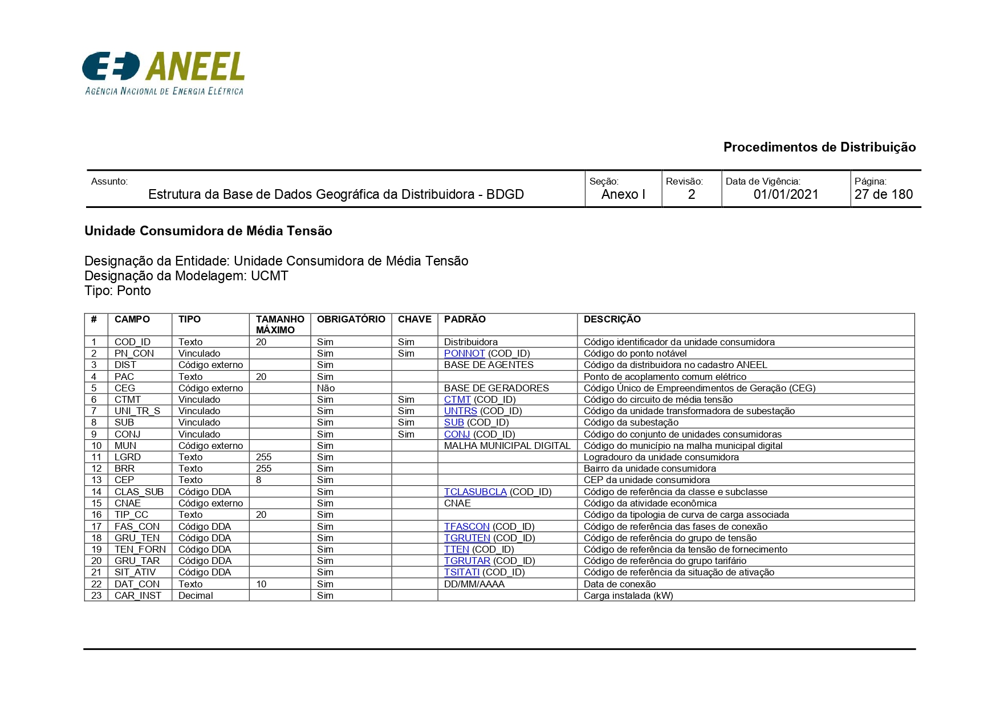
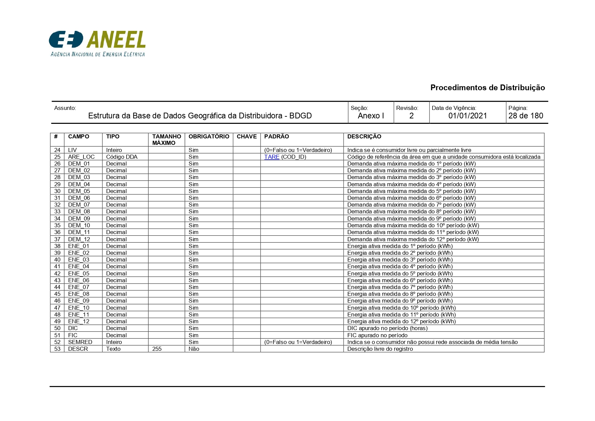

# 🔌 Projeto 03.2 — Média Tensão [PostgreSQL]

## Resumo Executivo

O Projeto 03.2 — Média Tensão integra o Projeto 03 — Consumo Elétrico (BDGD/ANEEL) e tem como objetivo a ingestão, validação e estruturação dos dados de Unidades Consumidoras de Média Tensão (UCMT), utilizando o PostgreSQL como ferramenta central de investigação e entendimento do dataset.

- Este subprojeto possui caráter explicitamente formativo, sendo concebido como um ambiente de aprendizagem intencional voltado ao aprofundamento em SQL aplicado a dados reais, volumosos e estruturalmente complexos. O foco não está na entrega imediata de produtos analíticos finais, mas na construção de base conceitual sólida sobre ingestão, governança, validação estrutural e exploração orientada dos dados.

- A abordagem adotada é incremental e metodologicamente rigorosa, priorizando a fidelidade ao modelo oficial da ANEEL (BDGD/UCMT), a compreensão do comportamento real do dataset e a documentação cuidadosa das decisões técnicas. Etapas como modelagem analítica avançada, automação e integração com ferramentas de visualização são tratadas como desdobramentos futuros, após a consolidação do entendimento estrutural.

Este documento atua como um relatório vivo, registrando decisões, validações e aprendizados ao longo da evolução do pipeline de dados.

<br>

## 📌 Sumário

- [Resumo Executivo](#resumo-executivo)
- [Ambiente Técnico](#ambiente-técnico)
- [Arquitetura de Ingestão](#arquitetura-de-ingestão--visão-geral)

- [Etapa 0 — Ingestão RAW](#etapa-0--ingestão-raw-versão-oficial)
- [Etapa 1 — Validação do Header](#etapa-1----validação-controlada-do-header-raw-paralela)
- [Etapa 2 — Camada STAGE](#etapa-2--criação-da-camada-stage-schema-explícito)
- [Etapa 3 — Validação Semântica](#etapa-3--validação-semântica-oficial-layout-ucmt--prodist--aneel)
- [Etapa 4 — Dicionário UCMT](#etapa-4--extração-do-dicionário-de-referência-ucmt-base-normativa)
- [Etapa 5 — Validação Estrutural](#etapa-5--validação-estrutural-e-aderência-ao-modelo-ucmt)
- [Etapa 6 — Qualidade dos Dados](#etapa-6--validação-de-domínios-e-qualidade-dos-dados)


---
<br>

## Ambiente Técnico

### Banco de Dados

- **SGBD:** PostgreSQL 18.1
- **Sistema Operacional:** Windows x64
- **Ferramenta de administração:** pgAdmin 4
- **Database dedicado:** `bdgd_media_tensao`

<br>

### Configurações Gerais

- Porta: `5432`
- Usuário: `postgres`
- Conexão local validada

<br>

## Arquitetura de Ingestão — Visão Geral

A arquitetura adotada segue o princípio de **separação explícita entre dado bruto, estrutura e semântica**:

1. **RAW `(bdgd_media_tensao_raw)`** — preservação integral do CSV
2. **RAW de Validação `(bdgd_media_tensao_raw_v2)`** — verificação controlada do header
3. **STAGE `(bdgd_media_tensao_stage)`** — estruturação com schema explícito baseado no layout oficial

Nenhuma camada assume significado semântico sem validação documental.

---
<br>

## Etapa 0 — Ingestão RAW (Versão Oficial)

### Objetivo

Garantir a ingestão **integral e fiel** do dataset de Média Tensão, sem transformação, limpeza ou inferência estrutural.

### Implementação

- Criação da tabela `bdgd_media_tensao_raw`
- Estrutura: **1 coluna (`linha` TEXT)**
- Importação do CSV com:
  - Delimitador real: `;`
  - Encoding: `LATIN1`
  - **HEADER = YES**

<br>

### Resultado

- **312.074 registros** carregados
- Primeira linha já corresponde a dados válidos (UC)
- Header não ingerido como dado

---
<br>

## Seção Legacy — Experimento Exploratório Inicial (Descontinuado)

### Contexto

Foi testada inicialmente uma abordagem baseada em:
- ingestão com delimitador fictício;
- coluna única (`linha`);
- quebra posicional em colunas genéricas.

<br>

### Motivo do Abandono

Apesar de válida como experimento exploratório, a abordagem foi **formalmente descartada**, pois:
- não escala para ambientes profissionais;
- introduz ambiguidade semântica;
- dificulta governança e manutenção;
- gera dívida técnica evitável.

Essa estratégia permanece apenas como **registro histórico (legacy)**.

---
<br>

## Etapa 1 —  Validação Controlada do Header (RAW Paralela)

### Motivação

Para eliminar qualquer dúvida sobre:
- existência do header no CSV;
- comportamento do pgAdmin durante a importação;
- integridade do arquivo original;

foi executado um **teste controlado, documentado e reproduzível**.

<br>

### Procedimento

- Criação da tabela `bdgd_media_tensao_raw_v2` (1 coluna `linha`)
- Importação do **mesmo CSV**, com:
  - Delimitador: `;`
  - Encoding: `LATIN1`
  - **HEADER = NO**

<br>

### Evidência Empírica

Consulta executada:

```sql
SELECT *
FROM bdgd_media_tensao_raw_v2
LIMIT 2;
```

Resultado observado:
- Primeira linha contendo os nomes das colunas (`COD_ID_ENCR;DIST;PN_CON;...;POINT_Y`)
- Segunda linha iniciando os dados reais

<br>

### Conclusão Técnica

- O CSV **possui header explícito**
- O comportamento anterior do pgAdmin foi **correto e esperado**
- O header foi tratado como **metadado**, não como dado

Essa validação fundamenta toda a estruturação posterior.

---
<br>

## Etapa 2 — Criação da Camada STAGE (Schema Explícito)

### Princípio Central

> Em projetos de dados reais, **colunas genéricas (`col_1`, `col_2`, …)** não são aceitáveis quando o schema original existe.

A camada *stage* deve **preservar semântica, governança e rastreabilidade**.

<br>

### Abordagem Adotada

- Criação da tabela *stage* **diretamente a partir do header validado do CSV**
- Correspondência **1:1** entre colunas da *stage* e colunas oficiais do arquivo
- Tipos definidos inicialmente como `TEXT`

<br>

### Query — Criação da Tabela *Stage*

```sql
CREATE TABLE bdgd_media_tensao_stage (
    COD_ID_ENCR TEXT,
    DIST TEXT,
    PN_CON TEXT,
    PAC TEXT,
    CTMT TEXT,
    UNI_TR_AT TEXT,
    SUB TEXT,
    CONJ TEXT,
    MUN TEXT,
    CEG_GD TEXT,
    LGRD TEXT,
    BRR TEXT,
    CEP TEXT,
    CLAS_SUB TEXT,
    CNAE TEXT,
    TIP_CC TEXT,
    FAS_CON TEXT,
    GRU_TEN TEXT,
    TEN_FORN TEXT,
    GRU_TAR TEXT,
    SIT_ATIV TEXT,
    DAT_CON TEXT,
    CAR_INST TEXT,
    LIV TEXT,
    ARE_LOC TEXT,
    TIP_SIST TEXT,
    DEM_CONT TEXT,
    DEM_01 TEXT,
    DEM_02 TEXT,
    DEM_03 TEXT,
    DEM_04 TEXT,
    DEM_05 TEXT,
    DEM_06 TEXT,
    DEM_07 TEXT,
    DEM_08 TEXT,
    DEM_09 TEXT,
    DEM_10 TEXT,
    DEM_11 TEXT,
    DEM_12 TEXT,
    ENE_01 TEXT,
    ENE_02 TEXT,
    ENE_03 TEXT,
    ENE_04 TEXT,
    ENE_05 TEXT,
    ENE_06 TEXT,
    ENE_07 TEXT,
    ENE_08 TEXT,
    ENE_09 TEXT,
    ENE_10 TEXT,
    ENE_11 TEXT,
    ENE_12 TEXT,
    DIC_01 TEXT,
    DIC_02 TEXT,
    DIC_03 TEXT,
    DIC_04 TEXT,
    DIC_05 TEXT,
    DIC_06 TEXT,
    DIC_07 TEXT,
    DIC_08 TEXT,
    DIC_09 TEXT,
    DIC_10 TEXT,
    DIC_11 TEXT,
    DIC_12 TEXT,
    FIC_01 TEXT,
    FIC_02 TEXT,
    FIC_03 TEXT,
    FIC_04 TEXT,
    FIC_05 TEXT,
    FIC_06 TEXT,
    FIC_07 TEXT,
    FIC_08 TEXT,
    FIC_09 TEXT,
    FIC_10 TEXT,
    FIC_11 TEXT,
    FIC_12 TEXT,
    SEMRED TEXT,
    DESCR TEXT,
    DATA_BASE TEXT,
    POINT_X TEXT,
    POINT_Y TEXT
);
```
<br>

### Validações Estruturais Executadas

```sql
SELECT COUNT(*) 
FROM information_schema.columns
WHERE table_name = 'bdgd_media_tensao_stage';
```

```sql
SELECT
    ordinal_position,
    column_name
FROM information_schema.columns
WHERE table_name = 'bdgd_media_tensao_stage'
ORDER BY ordinal_position;
```

```sql
SELECT COUNT(*) FROM bdgd_media_tensao_stage;
```

```sql
SELECT *
FROM bdgd_media_tensao_stage
LIMIT 5;
```

Essas queries confirmaram:
- número correto de colunas;
- ordem fiel ao CSV original;
- carga íntegra dos registros;
- alinhamento estrutural perfeito.

<br>

### Exemplo de Resultado (recorte ilustrativo)

| COD_ID_ENCR | DIST | PN_CON | PAC | CTMT | MUN | GRU_TAR | SIT_ATIV | DAT_CON | DEM_01 | ENE_01 | DATA_BASE |
|------------|------|--------|-----|------|-----|---------|----------|---------|--------|--------|-----------|
| D485CC53… | 385 | 2105244401 | SRP092105244401 | SRP01_AL009 | 3547502 | A4 | AT | 30/09/2017 | 115.584 | 104877 | 31DEC2024 |

> *Valores apresentados apenas para fins ilustrativos; o dataset completo contém centenas de milhares de registros.

<br>

A execução da camada stage resultou em um schema estruturado, semanticamente explícito e fiel ao layout original do CSV, com as seguintes garantias técnicas:

- ✔ Header validado empiricamente e utilizado como fonte única de definição do schema
- ✔ Estratégia de ingestão consolidada, com separação clara entre RAW e STAGE
- ✔ Dado bruto preservado integralmente na camada RAW
- ✔ Tabela STAGE criada com schema explícito, sem uso de colunas genéricas
- ✔ Número de colunas e ordem validados, garantindo correspondência 1:1 com o CSV
- ✔ Integridade da carga confirmada, sem perdas ou desalinhamentos

Com isso, a camada stage passa a atuar como base estrutural confiável para as próximas etapas de tipagem, validação semântica e modelagem analítica.

---
<br>


## Etapa 3 — Validação Semântica Oficial (Layout UCMT — PRODIST / ANEEL)

### Motivação

Após a validação empírica do header e a consolidação da camada *stage* com schema explícito, tornou-se necessário **confirmar formalmente a semântica de cada campo** presente no dataset, garantindo aderência total ao **modelo regulatório oficial da ANEEL**.

Essa etapa visa eliminar ambiguidades interpretativas, especialmente em campos codificados, métricas elétricas e variáveis temporais de demanda e energia.

<br>

### Referencial Normativo Utilizado

Foi identificado e isolado o **layout oficial da entidade UCMT (Unidade Consumidora de Média Tensão)**, conforme definido nos **Procedimentos de Distribuição (PRODIST)** da ANEEL:

- Entidade: **UCMT — Unidade Consumidora de Média Tensão**
- Modelagem: **UCMT**
- Tipo geométrico: **Ponto**
- Documento: **Estrutura da Base de Dados Geográfica da Distribuidora — BDGD**
- Seção: **Anexo I**
- Revisão: **2**
- Vigência: **01/01/2021**

Esse layout constitui o **dicionário de dados oficial** para interpretação semântica do conjunto analisado.

<br>

### Estrutura Conceitual da Entidade UCMT

O layout UCMT define **53 campos oficiais**, organizáveis conceitualmente nos seguintes blocos funcionais:

- **Identificação e Topologia Elétrica**  
  Campos responsáveis pela identificação única da unidade consumidora e sua associação à rede de distribuição (ex.: `COD_ID`, `DIST`, `CTMT`, `SUB`, `CONJ`).

- **Localização Geográfica e Enquadramento Territorial**  
  Informações de município, endereço e área regulatória, utilizadas para análises espaciais e critérios de continuidade (ex.: `MUN`, `LGRD`, `BRR`, `CEP`, `ARE_LOC`).

- **Perfil Econômico, Tarifário e Técnico**  
  Campos que caracterizam o enquadramento econômico, tarifário e elétrico da unidade consumidora (ex.: `CNAE`, `CLAS_SUB`, `GRU_TAR`, `GRU_TEN`, `TEN_FORN`, `TIP_CC`, `FAS_CON`, `LIV`).

- **Características Elétricas Declaradas**  
  Informações de carga instalada conforme cadastro da distribuidora (ex.: `CAR_INST`).

- **Séries Temporais de Demanda e Energia**  
  Conjuntos de campos mensais (`DEM_01` a `DEM_12`, `ENE_01` a `ENE_12`) que representam, respectivamente:
  - demanda ativa máxima (kW);
  - energia ativa consumida (kWh);  
  conforme valores medidos, faturados ou estimados, seguindo regras explícitas do PRODIST.

- **Indicadores de Continuidade do Serviço**  
  Métricas regulatórias anuais de interrupção individual (ex.: `DIC`, `FIC`).

- **Campos de Controle e Observação**  
  Indicadores auxiliares e descrição livre do registro (ex.: `SEMRED`, `DESCR`).

<br>

### Introdução Visual — Evidência Documental do Layout Oficial

Para reforçar a rastreabilidade metodológica e destacar o alinhamento com o modelo regulatório, foram extraídos os **dois primeiros quadros descritivos do layout UCMT (Unidades Consumidoras de Média Tensão)** diretamente do manual oficial, convertidos em imagens e incorporados ao `README.md` como evidência visual do dicionário de dados adotado.





Esses registros visuais documentam:
- a definição formal da entidade UCMT;
- a listagem oficial dos campos e seus significados;
- o enquadramento regulatório utilizado como base semântica do projeto.

<br>

### Conclusão Técnica

A validação semântica confirmou que:

- o dataset analisado está conceitualmente alinhado à entidade **UCMT** definida pela ANEEL;
- a camada *stage* preserva integralmente a semântica oficial dos campos;
- o manual PRODIST passa a atuar como **fonte normativa explícita**, complementando a validação empírica realizada nas etapas anteriores.

Com isso, o projeto passa a dispor de **base estrutural e semântica sólida**, apta para as próximas fases de:
- tipagem definitiva;
- validação de domínios;
- modelagem analítica e exploração dos dados.

---
<br>

## Etapa 4 — Extração do Dicionário de Referência UCMT (Base Normativa)

### Motivação

Com a estrutura física do dataset consolidada na camada *stage* e a validação semântica oficial realizada, torna-se necessário criar um **artefato de referência explícito** que represente o **dicionário normativo da entidade UCMT**, de forma independente do dataset real.

Essa etapa tem como objetivo **preparar o terreno para comparações futuras**, permitindo identificar de maneira objetiva:

- campos ausentes no dataset;
- campos adicionais não previstos no layout oficial;
- divergências de nomenclatura, granularidade ou semântica;
- diferenças decorrentes de versão, distribuidora ou recorte operacional.

<br>

### Princípio Metodológico

> O manual PRODIST define **como os dados deveriam existir**.  
> O CSV representa **como os dados realmente existem**.  
> A análise técnica exige que ambos sejam tratados como fontes distintas.

Assim, o dicionário UCMT foi extraído e estruturado como um **objeto de referência autônomo**, sem qualquer adaptação prévia ao dataset analisado.

<br>

### Estrutura do Dicionário de Referência

O dicionário foi organizado de forma tabular, contendo, para cada campo oficial da UCMT:

- nome do campo conforme o layout PRODIST;
- tipo lógico definido pela ANEEL;
- obrigatoriedade;
- domínio ou tabela de referência (quando aplicável);
- descrição oficial do significado do campo.

Esse formato foi projetado para permitir **comparação direta** com a camada *stage* em etapas posteriores.

<br>

### Organização Analítica do Dicionário UCMT

O dicionário de referência UCMT foi deliberadamente organizado em **blocos conceituais**, que representam **eixos analíticos independentes e complementares**. Essa segmentação não tem caráter apenas documental, mas orienta diretamente **como as análises futuras serão estruturadas, validadas e interpretadas** ao longo do projeto.

Cada bloco agrupa campos que compartilham natureza funcional semelhante, permitindo:

- validações estruturais e semânticas focadas;
- análises orientadas a contexto (técnico, geográfico, econômico);
- separação clara entre atributos estáticos e séries temporais;
- reutilização dos mesmos eixos analíticos em diferentes ferramentas e etapas do pipeline.

Os blocos definidos são:

- **BLOCO 1️⃣ - Identificação e Topologia Elétrica**  
  Campos que descrevem o vínculo da unidade consumidora com a infraestrutura elétrica e a organização do sistema de distribuição.

- **BLOCO 2️⃣ - Localização Geográfica**  
  Atributos espaciais e de endereço, utilizados para análises territoriais, regionais e georreferenciadas.

- **BLOCO 3️⃣ - Perfil Econômico, Tarifário e Técnico**  
  Campos que caracterizam o tipo de consumidor, sua classificação regulatória e parâmetros técnicos de fornecimento.

- **BLOCO 4️⃣ - Séries Temporais — Demanda**  
  Variáveis mensais associadas à demanda elétrica, com comportamento temporal e sazonal.

- **BLOCO 5️⃣ - Séries Temporais — Energia**  
  Variáveis mensais relacionadas ao consumo energético, fundamentais para análises de carga, perfil e eficiência.

- **BLOCO 6️⃣ - Continuidade e Controle**  
  Indicadores regulatórios e operacionais relacionados à qualidade do serviço e condições especiais de fornecimento.

Essa organização será mantida de forma consistente nas etapas posteriores do projeto, funcionando como **espinha dorsal analítica** tanto para validações em SQL quanto para explorações temporais, espaciais e futuras automatizações:

<br>

## Extração — Campos Oficiais da UCMT

### 🔎 Identificação e Topologia Elétrica

| campo_oficial | tipo_oficial | obrigatorio | dominio_referencia | descricao_oficial |
|---------------|--------------|-------------|--------------------|-------------------|
| COD_ID | Texto (20) | Sim | — | Código identificador da unidade consumidora |
| PN_CON | Vinculado | Sim | PONNOT | Código do ponto notável |
| DIST | Código externo | Sim | Base de Agentes | Código da distribuidora ANEEL |
| PAC | Texto (20) | Sim | — | Ponto de acoplamento comum elétrico |
| CTMT | Vinculado | Sim | CTMT | Circuito de média tensão |
| UNI_TR_S | Vinculado | Sim | UNTRS | Unidade transformadora de subestação |
| SUB | Vinculado | Sim | SUB | Subestação |
| CONJ | Vinculado | Sim | CONJ | Conjunto de unidades consumidoras |

---
<br>

### 🗺 Localização Geográfica

| campo_oficial | tipo_oficial | obrigatorio | dominio_referencia | descricao_oficial |
|---------------|--------------|-------------|--------------------|-------------------|
| MUN | Código externo | Sim | Malha Municipal Digital | Município |
| LGRD | Texto (255) | Sim | — | Logradouro |
| BRR | Texto (255) | Sim | — | Bairro |
| CEP | Texto (8) | Sim | — | CEP |

---
<br>

### 📄 Perfil Econômico, Tarifário e Técnico

| campo_oficial | tipo_oficial | obrigatorio | dominio_referencia | descricao_oficial |
|---------------|--------------|-------------|--------------------|-------------------|
| CLAS_SUB | Código DDA | Sim | TCLASUBCLA | Classe e subclasse |
| CNAE | Código externo | Sim | CNAE | Atividade econômica |
| TIP_CC | Texto (20) | Sim | — | Tipologia de curva de carga |
| FAS_CON | Código DDA | Sim | TFASCON | Fases de conexão |
| GRU_TEN | Código DDA | Sim | TGRUTEN | Grupo de tensão |
| TEN_FORN | Código DDA | Sim | TTEN | Tensão de fornecimento |
| GRU_TAR | Código DDA | Sim | TGRUTAR | Grupo tarifário |
| SIT_ATIV | Código DDA | Sim | TSITATI | Situação de ativação |
| LIV | Inteiro | Sim | 0 / 1 | Consumidor livre |
| ARE_LOC | Código DDA | Sim | TARE | Área de localização |
| CAR_INST | Decimal | Sim | — | Carga instalada (kW) |
| DAT_CON | Texto (DD/MM/AAAA) | Sim | — | Data de conexão |

---
<br>

### 📉 Séries Temporais — Demanda

| campo_oficial | tipo_oficial | descricao_oficial |
|---------------|--------------|-------------------|
| DEM_01 … DEM_12 | Decimal | Demanda ativa máxima mensal (kW) |

*Valores medidos, faturados ou estimados, conforme regras do PRODIST.*

---
<br>

### 💡 Séries Temporais — Energia

| campo_oficial | tipo_oficial | descricao_oficial |
|---------------|--------------|-------------------|
| ENE_01 … ENE_12 | Decimal | Energia ativa consumida mensal (kWh) |

*Valores medidos, faturados ou estimados, conforme regras do PRODIST.*

---
<br>

### ⚙ Continuidade e Controle

| campo_oficial | tipo_oficial | obrigatorio | descricao_oficial |
|---------------|--------------|-------------|-------------------|
| DIC | Decimal | Sim | Duração anual de interrupções (horas) |
| FIC | Decimal | Sim | Frequência anual de interrupções |
| SEMRED | Inteiro | Sim | Indicador de conexão sem rede MT |
| DESCR | Texto (255) | Não | Descrição livre |

---
<br>

### ⚠ Pontos de Atenção

| campo_stage | campo_oficial | status | observacao |
|------------|---------------|--------|------------|
| COD_ID_ENCR | COD_ID | 🔶 Divergente | Versão criptografada |
| DIC_01 | DIC | 🔶 Granularidade diferente | Manual define valor anual |
| TIP_SIST | — | 🔴 Não documentado | Campo não previsto no UCMT |

---
<br>

### Finalidade Analítica da Etapa

O dicionário de referência UCMT gerado nesta etapa **não sofre ajustes para se adequar ao dataset real**.  
Ele será utilizado, nas próximas fases do projeto, como base para:

- mapeamento *campo_stage × campo_oficial*;
- identificação de divergências estruturais e semânticas;
- documentação explícita de exceções e extensões do dataset;
- suporte à modelagem analítica e à comunicação técnica do projeto.

Essa separação deliberada entre **norma** e **implementação** assegura rigor metodológico, rastreabilidade e transparência analítica.

---
<br>

## Etapa 5 — Validação Estrutural e Aderência ao Modelo UCMT

Nesta etapa, foi realizada a **validação estrutural completa** da tabela `bdgd_media_tensao_stage`, com foco exclusivo na **comparação nominal e estrutural** entre os campos presentes no banco de dados e o **modelo lógico oficial UCMT (Unidade Consumidora de Média Tensão)** definido no Manual da BDGD/ANEEL.

⚠️ Ressalta-se que **não houve qualquer análise de valores, domínios, semântica ou comportamento dos dados**. O objetivo desta etapa foi estritamente confirmar **aderência estrutural e consistência de modelagem**.

<br>

---

### 🔐 Princípio de Aderência Analítica ao Manual UCMT

A partir desta etapa, estabelece-se formalmente o seguinte **princípio metodológico de condução das análises**:

> **O Manual UCMT (BDGD/ANEEL) constitui a fonte normativa primária do modelo analítico.**  
> Apenas campos **explicitamente definidos no manual** serão utilizados como base para análises, métricas, agregações e inferências.

Campos **não previstos no modelo UCMT oficial** somente poderão ser incorporados às análises se atenderem **simultaneamente** aos seguintes critérios:

1. relevância técnica ou elétrica comprovada;
2. impacto direto na interpretação do comportamento do sistema;
3. ausência de substituto normativo equivalente no manual;
4. documentação explícita e justificada no relatório.

Até o momento, **apenas um campo adicional atende a esses critérios**:

- `TIP_SIST` — indicador de tipologia do sistema elétrico, considerado **estruturalmente relevante** para análises operacionais e de topologia, apesar de não constar no layout UCMT oficial.

Todos os demais campos não normativos identificados na base foram **explicitamente excluídos do escopo analítico**, permanecendo apenas como suporte técnico ou metadado operacional.

Esse princípio garante **rastreabilidade normativa**, **comparabilidade entre projetos** e **consistência metodológica** ao longo de todo o Projeto 03.

<br>

---

### 🔹 5.1 Extração da Estrutura da Tabela

Foi extraída a lista completa de colunas da tabela `bdgd_media_tensao_stage`, totalizando **72 campos**, incluindo:

- identificadores e vínculos institucionais;
- campos de localização e endereço;
- características contratuais, tarifárias e técnicas;
- séries temporais mensais de demanda, energia e indicadores de continuidade;
- campos operacionais e geoespaciais adicionais.

A extração foi realizada diretamente a partir do banco de dados, garantindo fidelidade absoluta à estrutura efetivamente ingerida.

<br>

---

### 🔹 5.2 Comparação Nominal com o Manual UCMT (BDGD)

A estrutura extraída foi comparada **campo a campo** com os **53 atributos oficiais** definidos para a entidade UCMT no Manual da BDGD.

#### 5.2.1 Campos aderentes ao modelo UCMT

A ampla maioria dos campos apresentou **aderência direta**, com correspondência clara entre o nome lógico do manual e o nome físico no banco, considerando:

- padronização para `snake_case`;
- inclusão de sufixos técnicos decorrentes do processo de ingestão (ex.: `_encr`, `_gd`, `_at`);
- adequação a convenções internas da base.

Não foram identificadas inconsistências estruturais nesses casos.

<br>

#### 5.2.2 Séries temporais mensais

Os seguintes conjuntos de variáveis foram corretamente expandidos no banco em formato mensal:

- `DEM_01` a `DEM_12` (Demanda);
- `ENE_01` a `ENE_12` (Energia).

Essa expansão está plenamente alinhada ao modelo lógico e às necessidades analíticas posteriores.

<br>

#### 5.2.3 Divergência estrutural documentada (DIC e FIC)

No modelo UCMT oficial, os indicadores de continuidade:

- `DIC`;
- `FIC`;

são definidos como **atributos anuais**.

Na base ingerida, esses campos foram modelados como **séries mensais**:

- `DIC_01` a `DIC_12`;
- `FIC_01` a `FIC_12`.

Essa divergência **não caracteriza erro**, mas sim uma **decisão de modelagem da distribuidora**, que deverá ser considerada explicitamente nas etapas analíticas futuras.

<br>

#### 5.2.4 Campos adicionais não previstos no modelo UCMT

Foram identificados campos presentes no banco que **não constam no modelo lógico UCMT**, mas são compatíveis com a natureza operacional da BDGD:

- `data_base` (referência temporal do snapshot);
- `point_x`;
- `point_y` (coordenadas geoespaciais).

Esses campos foram mantidos e documentados como **extensões técnicas da base**, sem impacto negativo na aderência estrutural.

<br>

---

### 📋 Universo de Campos Utilizados nas Análises

A tabela a seguir consolida **todos os campos efetivamente utilizados nas análises**, conforme o princípio de aderência normativa estabelecido.

#### 🔎 Identificação e Topologia Elétrica

| campo | origem | observacao |
|------|--------|------------|
| COD_ID | Manual UCMT | Identificador primário da UC |
| PN_CON | Manual UCMT | Ponto notável |
| DIST | Manual UCMT | Distribuidora |
| PAC | Manual UCMT | Ponto de acoplamento comum |
| CTMT | Manual UCMT | Circuito de média tensão |
| UNI_TR_S | Manual UCMT | Unidade transformadora |
| SUB | Manual UCMT | Subestação |
| CONJ | Manual UCMT | Conjunto elétrico |
| TIP_SIST | Exceção técnica | Não previsto no manual, mantido por relevância estrutural |

---
<br>

#### 🗺 Localização Geográfica

| campo | origem | observacao |
|------|--------|------------|
| MUN | Manual UCMT | Município |
| LGRD | Manual UCMT | Logradouro |
| BRR | Manual UCMT | Bairro |
| CEP | Manual UCMT | Código postal |

---
<br>

#### 📄 Perfil Econômico, Tarifário e Técnico

| campo | origem | observacao |
|------|--------|------------|
| CLAS_SUB | Manual UCMT | Classe e subclasse |
| CNAE | Manual UCMT | Atividade econômica |
| TIP_CC | Manual UCMT | Tipologia de curva de carga |
| FAS_CON | Manual UCMT | Fases de conexão |
| GRU_TEN | Manual UCMT | Grupo de tensão |
| TEN_FORN | Manual UCMT | Tensão de fornecimento |
| GRU_TAR | Manual UCMT | Grupo tarifário |
| SIT_ATIV | Manual UCMT | Situação da UC |
| LIV | Manual UCMT | Consumidor livre |
| ARE_LOC | Manual UCMT | Área de localização |
| CAR_INST | Manual UCMT | Carga instalada |
| DAT_CON | Manual UCMT | Data de conexão |

---
<br>

#### 📉 Séries Temporais — Demanda

| campo | origem | observacao |
|------|--------|------------|
| DEM_01 … DEM_12 | Manual UCMT | Demanda mensal (kW) |

---
<br>

#### 💡 Séries Temporais — Energia

| campo | origem | observacao |
|------|--------|------------|
| ENE_01 … ENE_12 | Manual UCMT | Energia mensal (kWh) |

---
<br>

#### ⚙ Continuidade do Serviço

| campo | origem | observacao |
|------|--------|------------|
| DIC_01 … DIC_12 | Manual UCMT (adaptado) | Manual define valor anual |
| FIC_01 … FIC_12 | Manual UCMT (adaptado) | Modelagem mensal na base |

---
<br>

#### 🚫 Campos Excluídos do Escopo Analítico

| campo | motivo |
|------|--------|
| data_base | Metadado de snapshot |
| point_x / point_y | Uso geoespacial fora do escopo atual |
| descr | Campo livre sem padronização |
| campos operacionais adicionais | Não normativos |

<br>

---

### 🔹 5.3 Conclusão da Etapa

A tabela `bdgd_media_tensao_stage` apresenta **alta aderência estrutural** ao modelo lógico UCMT definido pela ANEEL, com adaptações técnicas esperadas para ingestão, versionamento temporal e georreferenciamento.

Nenhuma inconsistência estrutural crítica foi identificada.

Com isso, a **Etapa 5 — Validação Estrutural** é considerada **formalmente concluída**, estando o projeto apto a avançar para etapas posteriores de validação de domínios, tipagem ou análise, conforme planejamento metodológico.

---
<br>

## Etapa 6 — Validação de Domínios e Qualidade dos Dados

### Contexto

Com a estrutura, semântica e aderência normativa da tabela `bdgd_media_tensao_stage` consolidadas nas etapas anteriores, esta fase concentra-se na validação sistemática do conteúdo dos campos.

O foco passa a ser a verificação da conformidade dos valores com os domínios regulatórios, a identificação de inconsistências e a avaliação da qualidade interna do dataset.

Nesta etapa, não serão realizadas intervenções, correções ou transformações nos dados. O objetivo é diagnóstico técnico e documentação analítica, servindo como base para as fases posteriores de tipagem, modelagem e consolidação.

<br>

### Abordagem Metodológica

A validação será conduzida por blocos analíticos, conforme a organização conceitual previamente definida no projeto, considerando os seguintes agrupamentos:

- Bloco 1 — Identificação e Topologia Elétrica  
  `COD_ID_ENCR, PN_CON, DIST, PAC, CTMT, UNI_TR_AT, SUB, CONJ, TIP_SIST`

- Bloco 2 — Localização Geográfica  
  `MUN, LGRD, BRR, CEP, ARE_LOC`

- Bloco 3 — Perfil Econômico, Tarifário e Técnico  
  `CLAS_SUB, CNAE, TIP_CC, FAS_CON, GRU_TEN, TEN_FORN, GRU_TAR, SIT_ATIV, LIV, CAR_INST, DAT_CON`

- Bloco 4 — Séries Temporais — Demanda  
  `DEM_01 a DEM_12`

- Bloco 5 — Séries Temporais — Energia  
  `ENE_01 a ENE_12`

- Bloco 6 — Continuidade e Controle  
  `DIC_01 a DIC_12, FIC_01 a FIC_12, SEMRED, DESCR`


> Cada bloco será analisado de forma independente, com registro das consultas executadas, padrões identificados e eventuais inconsistências observadas.

<br>

### 6.1 — Completude dos Campos

A análise inicial de preenchimento dos campos do Bloco 1 indicou elevada integridade estrutural do dataset.

#### Consulta Executada

```sql
SELECT
    COUNT(*)                            AS total_registros,

    COUNT(COD_ID_ENCR)                  AS cod_id_encr_preenchido,
    COUNT(PN_CON)                       AS pn_con_preenchido,
    COUNT(DIST)                         AS dist_preenchido,
    COUNT(PAC)                          AS pac_preenchido,
    COUNT(CTMT)                         AS ctmt_preenchido,
    COUNT(UNI_TR_AT)                    AS uni_tr_at_preenchido,
    COUNT(SUB)                          AS sub_preenchido,
    COUNT(CONJ)                         AS conj_preenchido,
    COUNT(TIP_SIST)                     AS tip_sist_preenchido

FROM bdgd_media_tensao_stage;
```

<br>

#### Resultado Obtido

| Campo       | Registros Preenchidos | Registros Ausentes | Total    | Percentual |
|-------------|------------------------|--------------------|----------|------------|
| COD_ID_ENCR | 312.074                | 0                  | 312.074  | 100,00%    |
| PN_CON      | 311.974                | 100                | 312.074  | 99,97%     |
| DIST        | 312.074                | 0                  | 312.074  | 100,00%    |
| PAC         | 312.074                | 0                  | 312.074  | 100,00%    |
| CTMT        | 312.051                | 23                 | 312.074  | 99,99%     |
| UNI_TR_AT   | 300.204                | 11.870             | 312.074  | 96,20%     |
| SUB         | 310.995                | 1.079              | 312.074  | 99,65%     |
| CONJ        | 312.074                | 0                  | 312.074  | 100,00%    |
| TIP_SIST    | 312.074                | 0                  | 312.074  | 100,00%    |

---

#### Observações
- Os campos COD_ID_ENCR, DIST, PAC, CONJ e TIP_SIST apresentaram completude total.
- Foram observadas perdas pontuais nos campos PN_CON (≈0,03%) e CTMT (≈0,007%), sem impacto estrutural relevante.
- O campo SUB apresentou 0,35% de registros nulos, indicando lacunas limitadas na representação da topologia.
- Destaca-se o campo UNI_TR_AT, com aproximadamente 3,8% de ausência (11.870 registros), sugerindo inconsistências associadas a registros legados ou processos de migração.
